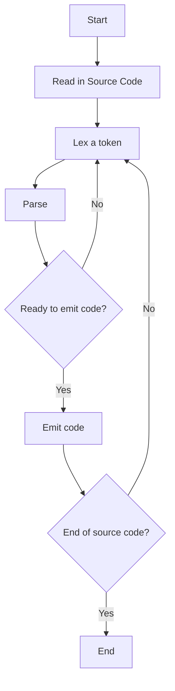

A program that
- transforms source code to machine code
- (or) transforms input string to structured output
- (or) translate programs from high-level [[Programming language|programming language]] (hide details through abstractions) to low-level language (exposes underlying hardware)

In other words, a program that converts code written in one language (source language) into another language (target language). 
- Single-pass compiler is a compiler that passes through the source code once and immediately translates it into target language. [[Compiled and Interpreted Languages|This is different from how interpreted languages are understood]].

On a high-level, there are three main parts: [[Lexer]], [[Parser]], and code generator.
- One approach is to have standalone versions of each part. 
	- A standalone lexer reads source code and writes a temporary file with tokens and other information
	- A standalone parser that reads in file from lexer and parses it to produce a data structure like an _abstract syntax tree_
	- A standalone code generator that uses the AST to write final output code
- The divisions can be made smaller, breaking it down into tiniest units of work to create a nanopass compiler

[[LLVM]] is a popular set of tools and libraries that provide a framework for building compilers. A nice place to start is by working with [[PL⁄ 0]].

**High-level Compiler Pipeline**

> [!note] Phases of Compiler
> 1. [[Lexical Analysis]]
> 2. Parsing
> 3. Semantic Analysis
> 4. Optimization
> 5. Code Generation
> 
> 