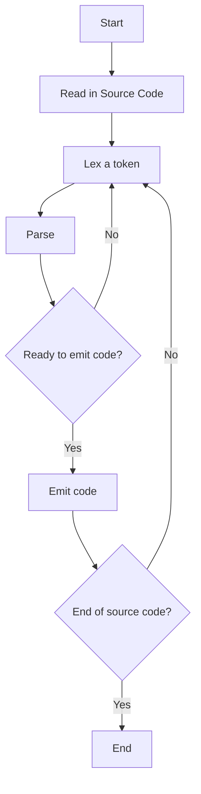

Compiler is a program that converts code written in one language (source language) into another language (target language). 
- Single-pass compiler is a compiler that passes through the source code once and immediately translates it into target language. 

On a high-level, there are three main parts: [[Lexer]], parser, and code generator.
- One approach is to have standalone versions of each part. 
	- A standalone lexer reads source code and writes a temporary file with tokens and other information
	- A standalone parser that reads in file from lexer and parses it to produce a data structure like an _abstract syntax tree_
	- A standalone code generator that uses the AST to write final output code
- The divisions can be made smaller, breaking it down into tiniest units of work to create a nanopass compiler

**High-level Compiler Pipeline**
