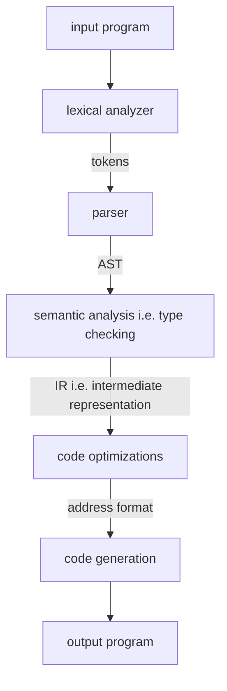

The structure (phases) of a compiler

- [[Lexical Analyzer]]
- [[Parsing]]
- [[Semantic Analysis]]
- [[Code Optimizations in Compilers|Code Optimizations in Compilers]]
- [[Code Generation in Compilers|Code Generation]]